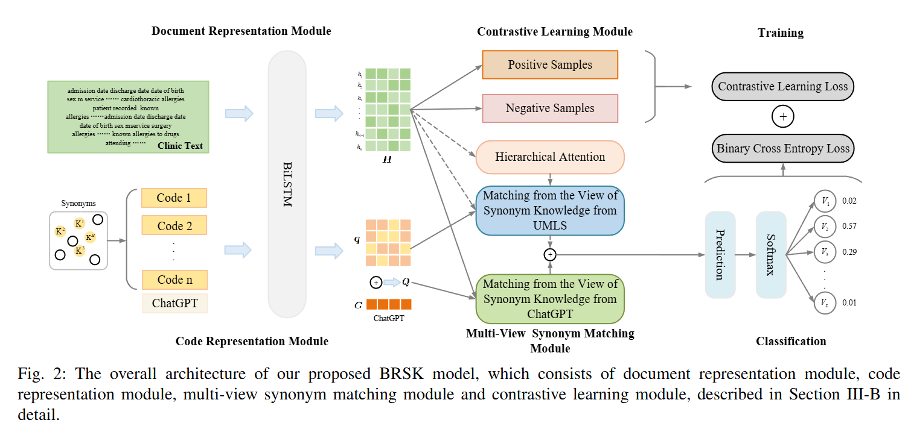

# ICD-BRSK

This is our Pytorch implementation for the paper:

> Zhizhuo Zhao, Wenpeng Lu, Xueping Peng, Lumin Xing, Weiyu Zhang, and Chaoqun Zheng(2024). Automated ICD Coding via Contrastive Learning with Back-reference and Synonym Knowledge for Smart Self-diagnosis Applications. IEEE Transactions on Consumer Electronics, 2024.



# Abstract

Smart applications are essential in intelligent consumer electronics. With the rising focus on health concerns, self-diagnosis applications on smart devices have gained widespread popularity, attracting significant attention from both consumers and researchers. These applications play a crucial role in accurately predicting potential diseases based on user-provided symptom descriptions, thereby facilitating effective treatment. Distinguishing between diseases with similar symptoms yet requiring different treatments is essential. However, automated ICD coding faces challenges due to subtle differences between some ICD codes. Although existing methods has utilized contrastive learning to differentiate between codes, precise selection of high-quality negative samples and accurate matching of code descriptions with patient conditions remain critical factors influencing their performance. Drawing inspiration from medical practices, doctors tend to utilize back-reference knowledge to differentiate between similar diseases. We propose a novel framework for automated ICD coding via contrastive learning with back reference and synonym knowledge (BRSK) for smart self-diagnosis applications. Specifically, by incorporating back-reference knowledge, we generate challenging negative samples, enhancing the effectiveness of contrastive learning. Additionally, multi-view synonym matching networks are used to fully leverage synonym knowledge, resulting in more precise modeling of semantic matching between codes and patient descriptions. Extensive experiments on MIMIC-III datasets demonstrate that BRSK significantly outperforms state-of-the-art baselines

# Environment

All codes are tested under Python 3.7.16, PyTorch 1.12.1.

numpy == 1.21.5

pillow == 9.4.0

scikit-learn ==1.0.2

transformers == 4.24.0

tqdm == 4.65.2

opt_einsum == 3.3.0


# Dataset Download/Preprocess MIMIC-III 50Data
To download MIMIC-III dataset, you must first obtain its license. Once you have acquired the license and downloaded the dataset, please follow [caml-mimic](https://github.com/jamesmullenbach/caml-mimic) to preprocess the dataset.

You should obtain **train_full.csv**, **test_full.csv**, **dev_full.csv**, **train_50.csv**, **test_50.csv**, **dev_50.csv** after preprocessing.
Please put them under **sample_data/mimic3**.
Then you should use **preprocess/generate_data_new.ipynb** for generating json format dataset.

```
sample_data
|   D_ICD_DIAGNOSES.csv
|   D_ICD_PROCEDURES.csv
|   ICD9_descriptions (already in repo)
└───mimic3/
|   |   NOTEEVENTS.csv
|   |   DIAGNOSES_ICD.csv
|   |   PROCEDURES_ICD.csv
|   |   *_hadm_ids.csv (already in repo)
```

# Preprocess MIMIC-III rare 50 Dataset

Run command below and rare50 data will be created like mimic3-50l_xxx.json and xxx_50l.csv. paper

```python
python collectrare50data.py
```

# Modify constant

-----------------------

Modify constant.py : change DATA_DIR to where your preprocessed data located.

To enable wandb, modify wandb.init(project="PROJECTNAME", entity="WANDBACCOUNT") in run_coder.py.

# Word embedding

Please download [word2vec_sg0_100.model](https://github.com/aehrc/LAAT/blob/master/data/embeddings/word2vec_sg0_100.model) from LAAT.
You need to change the path of word embedding.

# Use our code
MIMIC-III 50:
```python
python main.py --version mimic3 --combiner lstm --rnn_dim 256 --num_layers 2 --decoder MultiLabelMultiHeadLAATV2 --attention_head 8 --attention_dim 512 --learning_rate 5e-4 --train_epoch 20 --batch_size 8 --gradient_accumulation_steps 8 --xavier --main_code_loss_weight 0.0 --rdrop_alpha 5.0 --est_cls 1  --term_count 8  --sort_method random --neg_sample_K 1024 --right_drop 0.4
```

MIMIC-III rare 50：

```python
python test_main.py --version mimic3 --combiner lstm --rnn_dim 256 --num_layers 2 --decoder MultiLabelMultiHeadLAATV2 --attention_head 8 --attention_dim 512 --learning_rate 5e-4 --batch_size 8 --gradient_accumulation_steps 8 --xavier --main_code_loss_weight 0.0 --rdrop_alpha 5.0 --est_cls 1  --term_count 8  --sort_method random --model_path ./model_best_path
```


# Evaluate checkpoints

```
Dev_Epoch15
MACRO-auc, MICRO-auc, MACRO-f1, MICRO-f1, P@5, P@8, P@15, R@5, R@8, R@15
0.9310, 0.9493, 0.6946, 0.7292, 0.6732, 0.5443, 0.3533, 0.6705, 0.8068, 0.9247
------
Test_Epoch15
MACRO-auc, MICRO-auc, MACRO-f1, MICRO-f1, P@5, P@8, P@15, R@5, R@8, R@15
0.9293, 0.9488, 0.6905, 0.7282, 0.6765, 0.5523, 0.3615, 0.6572, 0.7987, 0.9228
```
[mimic3-50 checkpoint](https://drive.google.com/file/d/1wN2IxlfQMNd6M2g8fgZ5hqcl1aPRnCRj/view?usp=drive_link)

# Acknowledgement
```
@article{zhao2024BRSK,
  title={Automated ICD Coding via Contrastive Learning with Back-reference and Synonym Knowledge for Smart Self-diagnosis Applications},
  author={Zhizhuo Zhao, Wenpeng Lu, Xueping Peng, Lumin Xing, Weiyu Zhang, and Chaoqun Zheng},
  journal={IEEE Transactions on Consumer Electronics},
  year={2024}
}
```
